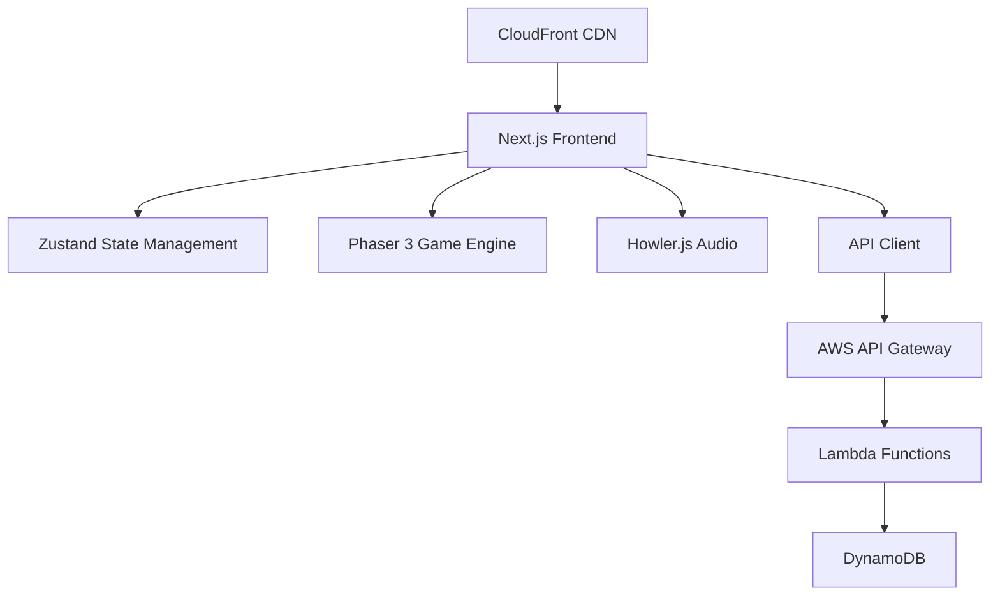

# Design Document

## Overview

"O Caminho Assombrado da Escola" é uma aplicação web responsiva que combina Next.js para a interface e navegação com Phaser 3 para o motor de jogo 2D. O sistema utiliza uma arquitetura moderna com estado global gerido por Zustand, áudio via Howler.js, e um backend serverless na AWS para o leaderboard.

## Architecture

### High-Level Architecture



### Technology Stack

- **Frontend Framework**: Next.js 14+ (App Router)
- **Game Engine**: Phaser 3 (Arcade Physics)
- **Language**: TypeScript
- **Styling**: Tailwind CSS
- **State Management**: Zustand
- **Audio**: Howler.js
- **Testing**: Jest + React Testing Library
- **Backend**: AWS Lambda + API Gateway + DynamoDB
- **CDN**: AWS CloudFront
- **IaC**: AWS CDK

### Folder Structure

```
src/
├── app/                    # Next.js App Router pages
│   ├── page.tsx           # Home page (leaderboard)
│   ├── nome/              # Name input page
│   ├── personagem/        # Character selection
│   ├── arma/              # Weapon selection
│   ├── dificuldade/       # Difficulty selection
│   ├── jogar/             # Game page
│   ├── final/             # Results page
│   └── api/               # API routes (proxy to AWS)
├── components/            # React components
│   ├── ui/                # Reusable UI components
│   ├── game/              # Game-specific components
│   └── forms/             # Form components
├── game/                  # Phaser game logic
│   ├── scenes/            # Game scenes
│   ├── entities/          # Game entities (Player, Enemies, Items)
│   ├── weapons/           # Weapon implementations
│   └── utils/             # Game utilities
├── store/                 # Zustand stores
├── lib/                   # Utilities and API clients
└── types/                 # TypeScript type definitions
public/
├── assets/                # Game assets
│   ├── sprites/           # Character and enemy sprites
│   ├── backgrounds/       # Background layers for parallax
│   ├── audio/             # Sound effects and music
│   └── ui/                # UI elements
```

## Components and Interfaces

### State Management (Zustand)

```typescript
interface GameState {
  // Player data
  firstName: string;
  lastName: string;
  character: 'boy' | 'girl';
  weapon: 'katana' | 'laser' | 'baseball' | 'bazooka';
  difficulty: 'easy' | 'medium' | 'impossible';
  
  // Game progress
  lives: number;
  score: number;
  gameStatus: 'menu' | 'playing' | 'paused' | 'finished';
  
  // Actions
  setPlayerName: (firstName: string, lastName: string) => void;
  setCharacter: (character: 'boy' | 'girl') => void;
  setWeapon: (weapon: string) => void;
  setDifficulty: (difficulty: 'easy' | 'medium' | 'impossible') => void;
  updateLives: (lives: number) => void;
  updateScore: (score: number) => void;
  resetGame: () => void;
}
```

### Game Entities

#### Player Entity
```typescript
interface Player {
  x: number;
  y: number;
  lives: number;
  score: number;
  weapon: Weapon;
  isInvulnerable: boolean;
  invulnerabilityTimer: number;
  
  move(direction: 'left' | 'right'): void;
  jump(): void;
  crouch(): void;
  attack(): void;
  takeDamage(): void;
}
```

#### Enemy Entities
```typescript
interface Enemy {
  x: number;
  y: number;
  type: 'ghost' | 'bat' | 'vampire' | 'mummy';
  isAlive: boolean;
  
  update(): void;
  onCollision(): void;
  destroy(): void;
}

class Ghost implements Enemy {
  // Low floating movement
}

class Bat implements Enemy {
  // Low floating movement (similar to ghost)
}

class Vampire implements Enemy {
  // Ground walking movement
}

class Mummy implements Enemy {
  // Slow ground walking movement
}
```

#### Weapon System
```typescript
interface Weapon {
  type: 'katana' | 'laser' | 'baseball' | 'bazooka';
  range: number;
  cooldown: number;
  ammunition?: number; // Only for bazooka
  
  attack(x: number, y: number): void;
  canAttack(): boolean;
}

class Katana implements Weapon {
  // Melee weapon with 40px range, 300ms cooldown
}

class LaserGun implements Weapon {
  // Projectile weapon with 500px/s speed, 200ms cooldown
}

class BaseballBat implements Weapon {
  // Melee weapon with 55px range, 450ms cooldown, knockback
}

class Bazooka implements Weapon {
  // Area damage weapon with 900ms cooldown, 6 ammunition
}
```

### UI Components

#### Navigation Flow
```typescript
// Page routing with state validation
const routes = [
  '/',           // Leaderboard
  '/nome',       // Name input (validates firstName && lastName)
  '/personagem', // Character selection (validates name)
  '/arma',       // Weapon selection (validates character)
  '/dificuldade',// Difficulty selection (validates weapon)
  '/jogar',      // Game canvas (validates difficulty)
  '/final'       // Results (validates game completion)
];
```

#### Mobile Controls
```typescript
interface MobileControls {
  leftSide: {
    moveLeft: TouchButton;
    moveRight: TouchButton;
  };
  rightSide: {
    jump: TouchButton;
    crouch: TouchButton;
    attack: TouchButton;
  };
}
```

### Game Scene Architecture

#### Main Game Scene
```typescript
class GameScene extends Phaser.Scene {
  player: Player;
  enemies: Phaser.Group;
  lifeItems: Phaser.Group;
  schoolGate: Phaser.GameObject;
  hud: HUD;
  difficulty: 'easy' | 'medium' | 'impossible';
  
  // Parallax background layers
  backgroundLayers: {
    moon_clouds: Phaser.TileSprite;
    houses: Phaser.TileSprite;
    trees: Phaser.TileSprite;
    street: Phaser.TileSprite;
  };
  
  create(): void;
  update(): void;
  handleCollisions(): void;
  spawnEnemies(): void;
  spawnLifeItems(): void;
  getDifficultyConfig(): DifficultyConfig;
}

interface DifficultyConfig {
  enemySpawnRate: number;    // Enemies per 1000px
  lifeItemSpawnRate: number; // Life items per 1000px
  enemyTypes: string[];      // Available enemy types
}

const DIFFICULTY_CONFIGS: Record<string, DifficultyConfig> = {
  easy: {
    enemySpawnRate: 2,       // Few enemies
    lifeItemSpawnRate: 8,    // Many life items
    enemyTypes: ['ghost', 'bat'] // Easier enemies only
  },
  medium: {
    enemySpawnRate: 4,       // Some enemies
    lifeItemSpawnRate: 3,    // Few life items
    enemyTypes: ['ghost', 'bat', 'vampire', 'mummy'] // All enemies
  },
  impossible: {
    enemySpawnRate: 8,       // Many enemies
    lifeItemSpawnRate: 0,    // Zero life items
    enemyTypes: ['vampire', 'mummy', 'ghost', 'bat'] // All enemies, prioritize harder ones
  }
};
```

## Data Models

### Score Model (DynamoDB)
```typescript
interface Score {
  scoreId: string;        // UUID primary key
  firstName: string;
  lastName: string;
  score: number;          // GSI sort key (descending)
  character: 'boy' | 'girl';
  weapon: string;
  difficulty: 'easy' | 'medium' | 'impossible';
  createdAt: string;      // ISO timestamp
}
```

### API Endpoints
```typescript
// GET /api/scores/top10
interface LeaderboardResponse {
  scores: Score[];
  total: number;
}

// GET /api/scores (with pagination for full list)
interface AllScoresResponse {
  scores: Score[];
  nextToken?: string;
  hasMore: boolean;
}

// POST /api/scores
interface SubmitScoreRequest {
  firstName: string;
  lastName: string;
  score: number;
  character: 'boy' | 'girl';
  weapon: string;
  difficulty: 'easy' | 'medium' | 'impossible';
}
```

## Error Handling

### Game Error Handling
- **Asset Loading Failures**: Fallback to placeholder assets, show loading error message
- **Audio Failures**: Graceful degradation, game continues without sound
- **Physics Errors**: Reset player position, log error for debugging
- **State Corruption**: Reset to last known good state or restart game

### API Error Handling
- **Network Failures**: Show offline message, cache scores locally
- **Server Errors**: Display user-friendly error messages
- **Timeout Errors**: Retry mechanism with exponential backoff
- **Validation Errors**: Show specific field validation messages

### Input Validation
```typescript
// Name validation
const validateName = (firstName: string, lastName: string): boolean => {
  return firstName.trim().length > 0 && lastName.trim().length > 0;
};

// Score validation (server-side)
const validateScore = (score: number): boolean => {
  return score >= 0 && score <= 999999; // Reasonable max score
};
```

## Testing Strategy

### Unit Testing
- **Game Logic**: Test weapon mechanics, enemy behavior, collision detection
- **State Management**: Test Zustand store actions and state updates
- **Utilities**: Test helper functions, validation logic
- **API Client**: Mock API responses, test error handling

### Integration Testing
- **Game Flow**: Test complete gameplay from start to finish
- **API Integration**: Test real API calls with test database
- **State Persistence**: Test state management across page navigation

### E2E Testing (Optional)
- **Complete User Journey**: Name input → Character → Weapon → Game → Results
- **Mobile Responsiveness**: Test touch controls on different screen sizes
- **Performance**: Test game performance on various devices

### Testing Tools
```typescript
// Jest configuration for game testing
const jestConfig = {
  testEnvironment: 'jsdom',
  setupFilesAfterEnv: ['<rootDir>/src/test/setup.ts'],
  moduleNameMapping: {
    '^@/(.*)$': '<rootDir>/src/$1'
  }
};

// Phaser testing utilities
class MockPhaser {
  // Mock Phaser objects for unit testing
}
```

## Performance Considerations

### Game Performance
- **Sprite Pooling**: Reuse enemy and projectile sprites
- **Efficient Collision Detection**: Use Phaser's built-in Arcade Physics
- **Asset Optimization**: Compress sprites and audio files
- **Memory Management**: Properly destroy unused game objects

### Web Performance
- **Code Splitting**: Lazy load game components
- **Asset Preloading**: Preload critical game assets
- **CDN Optimization**: Serve assets via CloudFront
- **Bundle Optimization**: Tree-shake unused dependencies

### Mobile Optimization
- **Touch Response**: Minimize touch input latency
- **Battery Usage**: Optimize game loop for mobile devices
- **Network Usage**: Minimize API calls, implement caching

## Security Considerations

### Client-Side Security
- **Input Sanitization**: Validate all user inputs
- **XSS Prevention**: Sanitize displayed user names
- **CSRF Protection**: Use Next.js built-in CSRF protection

### API Security
- **Rate Limiting**: Implement throttling on API Gateway
- **Origin Validation**: Restrict API access to known origins
- **Input Validation**: Server-side validation for all inputs
- **Anonymous Access**: No authentication required (MVP scope)

### Data Privacy
- **Minimal Data Collection**: Only collect necessary game data
- **No PII Storage**: Names are for leaderboard display only
- **Data Retention**: Consider implementing data cleanup policies